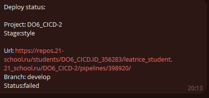

## CICD

* CI/CD (Continuous Integration/Continuous Delivery) - это практика разработки программного обеспечения, которая включает в себя автоматизацию процессов сборки, тестирования и развертывания приложений.

* Continuous Integration (непрерывная интеграция) - это процесс объединения изменений кода от разных разработчиков в общий репозиторий и автоматической проверки работоспособности приложения после каждого коммита. Целью CI является выявление и устранение конфликтов и ошибок в коде на ранних стадиях разработки, а также поддержание стабильности и работоспособности приложения.

* Continuous Delivery (непрерывная доставка) - это процесс автоматической сборки, тестирования и развертывания приложения на тестовой или продукционной среде после успешного прохождения CI. Целью CD является автоматизация процесса доставки приложения в конечную среду пользователей и обеспечение быстрой и надежной поставки новых функций и исправлений.

### Part 1. Настройка gitlab-runner

- Поднимим виртуальную машину Ubuntu Server 22.04 LTS.


- Скачай и установи на виртуальную машину gitlab-runner.

```
curl -L https://packages.gitlab.com/install/repositories/runner/gitlab-runner/script.deb.sh | sudo bash

sudo apt-get install gitlab-runner

sudo gitlab-runner start
```


- Запусти gitlab-runner и зарегистрируй его для использования в текущем проекте (DO6_CICD).


- Проверим что все корректно

```
gitlab-runner verify
``` 
используется для проверки настройки и связи GitLab Runner с GitLab-сервером.

```
gitlab-runner run
```
используется для запуска GitLab Runner в режиме интерактивного выполнения задач CI/CD на вашей системе.


### Part 2. Сборка

- В файле gitlab-ci.yml напишем этап запуска сборки через мейк файл из проекта C3. Файлы, полученные после сборки (артефакты), сохраним в произвольную директорию со сроком хранения 30 дней.


У нас есть один этап build, который будет выполняться при каждом запуске CI/CD процесса.

Для этапа build, мы указываем тег build, чтобы он мог быть выполнен только на GitLab Runner с таким тегом.

В разделе script, мы указываем команды, которые будут выполняться во время этапа build. В данном случае, мы переходим в директорию src/cat, выполняем команду make build, затем переходим в директорию src/grep и также выполняем команду make build.

В разделе artifacts, мы указываем пути к файлам, которые будут сохранены в качестве артефактов после успешного завершения этапа build. В данном случае, файлы src/cat/s21_cat и src/grep/s21_grep будут сохранены как артефакты.

Кроме того, мы указываем время хранения артефактов с помощью параметра expire_in. В данном случае, артефакты будут храниться в течение 30 дней.

* Результат:


### Part 3. Тест кодстайла

Напиши этап для CI, который запускает скрипт кодстайла (clang-format).


- Если кодстайл не прошел, то «зафейли» пайплайн. В пайплайне отобрази вывод утилиты clang-format.


### Part 4. Интеграционные тесты

Напишем этап для CI, который запускает твои интеграционные тесты из того же проекта.

Запусти этот этап автоматически только при условии, если сборка и тест кодстайла прошли успешно.


Если тесты не прошли, то «зафейли» пайплайн.


В пайплайне отобрази вывод, что интеграционные тесты успешно прошли / провалились.


### Part 5. Этап деплоя

Подними вторую виртуальную машину Ubuntu Server 22.04 LTS.

Напиши этап для CD, который «разворачивает» проект на другой виртуальной машине.


Добавим на вторую машину ssh ключ


Запусти этот этап вручную при условии, что все предыдущие этапы прошли успешно.
В файле gitlab-ci.yml добавь этап запуска написанного скрипта.


`when: manual` указывает, что это задание должно быть выполнено вручную, а не автоматически

Напиши bash-скрипт, который при помощи ssh и scp копирует файлы, полученные после сборки (артефакты), в директорию /usr/local/bin второй виртуальной машины.


В случае ошибки «зафейли» пайплайн.


### Part 6. Дополнительно. Уведомления

Настрой уведомления о успешном/неуспешном выполнении пайплайна через бота с именем «[твой nickname] DO6 CI/CD» в Telegram.


Добавляем в yml файл запуск скрипта после каждой стадии


Результат:


